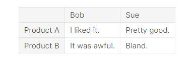
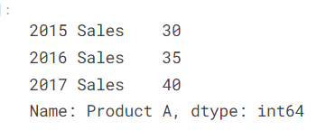

# Possible resoruces
* https://docs.microsoft.com/en-us/training/modules/plan-moon-mission-using-python-pandas/
* https://docs.microsoft.com/en-us/training/modules/explore-analyze-data-with-python/


## [Pandas Course on Kaggle](https://www.kaggle.com/learn/pandas)
* There are two core objects in pandas: the __DataFrame__ and the __Series__.

### Creating, Reading and Writing

* __dataframe__ is a table
* to get a dataframe instance
```py
my_dataframe = pd.DataFrame({'Yes': [50, 21], 'No': [131, 2]})
```

* you can replace the row numbers with the index proeprty like this

```py
pd.DataFrame({'Bob': ['I liked it.', 'It was awful.'], 
              'Sue': ['Pretty good.', 'Bland.']},
             index=['Product A', 'Product B'])
```



* series is a sequence of data values
* single column in data frame
* you can also index a series like you index  a dataframe
* series has one column name



* load data in to dataframe
* read_csv can do a lot
* To make pandas use an index column for the index (instead of creating a new one from scratch), we can specify an index_col.
```py
wine_reviews = pd.read_csv("cities.csv", index_col=0)
wine_reviews.shape # see how large the dataframe is
wine_reviews.head() grabs first five rows

```

### Indexing, Selecting & Assigning

* when you print this decides how many rows you see (up to 10)
```py
pd.set_option('display.max_rows', 4)
```


* if a column name is lowercase you can access it as a property on the data frome

```py
big_dataframe = pd.read_csv("cities.csv")
```