* learn to make indexing for any workload

# Genearl Indexing Guidelines
* unique on column
* improve perfoamce of querires
* we create index to perform workload
* be prepared to change  indexes
* lot of maintenance of index
* indexed views may be useless
* columnstore is good with performance


# Understainding Basic Index architecture
* SQL stores data in 8kb pages, stored in a balanced tree
* index has 0 or 1 root pages

## How SQL server uses indexes
* navigation down the root to  the leaf of a tree, single row or start and end of rnage of rows
 * index scan, - read the some of the leaf pages
 * key lookup - single row seek to clusterd index
 ## Using an index -
 for C(125.86) - right because c is bigger than B
 2ND BECAUSE 125.86 < 301
 then look down the leaf
 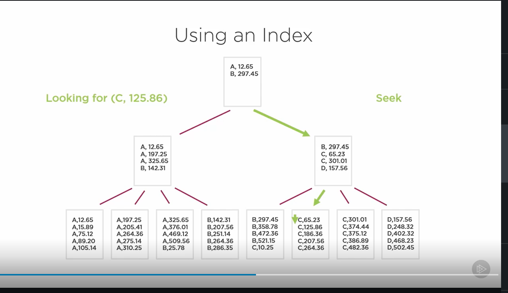
 * now to sum all rows just read the leafs no intermediates or root
 sum rows with value >250 scan with a predicate is used


[Index operations](03/demos/Module%203/IndexOperationsInExecPlans.sql)

* read a row to return a row its as good as you can get
* right click on  a path in the execution plan in azure data and you can  view its properties
  * the only the you care about is the predicated, # of pages read, row read and rows return ,
* clustered index enforces how table is ordered
* clustered based on actual data pages of table
* create cluster to organize table,
* create cluster based on how data will be accessed

## Cluster Index Guidelines
* the column should be small as possible
* 4 byte cluster key has 3 rows of pages
* 900 byte ends up into 6
* must be unique or sql will use a salt to make it unique more date
* want the cluster index to be ever increasing, so that you dont have page splits

* as pages get huge then you will see the pages start to differ
[Same_Table_Diff_Clustered_Index](Same_Table_Diff_Clustered_Index.sql)
[table stats](db_partition_stats.sql)

* organize the table
  * better data benefits

* support queries
  * better for data warehouse
  * table may take up more spaces

* dates are very good choice for clustered indexes

# Design Indexes to improve query perforamce Part 1

* nonclusted
* seperate structure from table, max is 999 but thats not best practice
  * always in sync with the table
  * dont have to contain all columns

* Predicates combined with or makes nonclustered more difficult
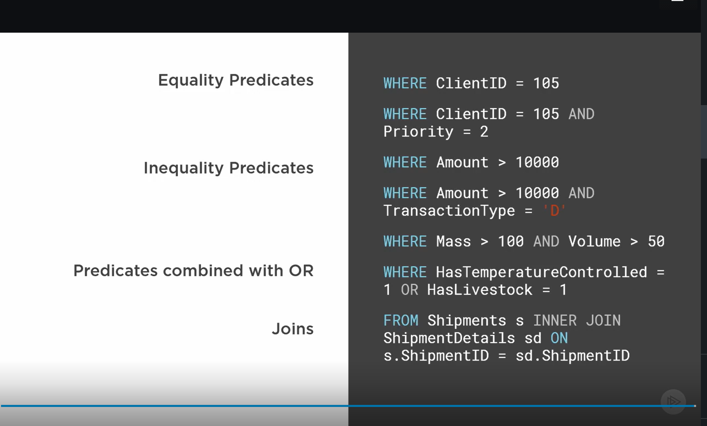

## Equality Predicates

* many queries using as few indexes as possible
* create index many query as possible can use
   * here you order by amnt and transaction type, 3 queries can use this one
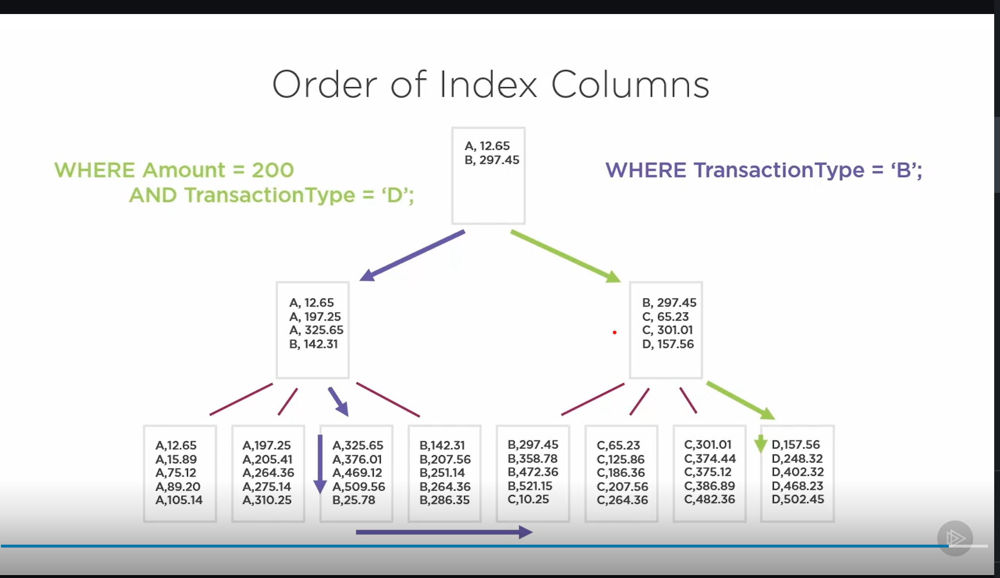

## Inequality Predicates
* every row you read you must return best practice
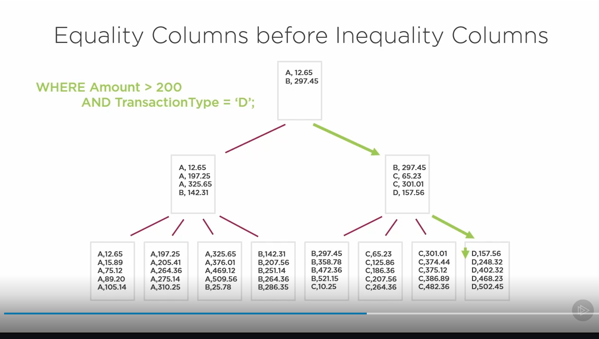
* multple inequalities are hard to scan because you must like do a range seek

# Predicates combined with OR
* SQL wont try to do a seek it will do one scan an apply the results


*sample
```sql

-- here you can refactor this query to better understand your indexes
SELECT TransactionID, ClientID, Amount, TransactionType FROM dbo.Transactions
	WHERE ClientID = 2875 AND (Amount > 2500 OR TransactionType = 'S')


-- this would be scane
SELECT TransactionID, ClientID, Amount, TransactionType FROM dbo.Transactions
	WHERE ( ClientID = 2875 AND Amount > 2500) OR (ClientID = 2875  AND TransactionType = 'S')

-- resonse now you get seeks\
  -- we reveresed the 2nd order becuase other queries might need a reverse idx to seek proeprly
CREATE NONCLUSTERED INDEX nc_idx_Transactoions_ClientIDAmount ON dbo.Transactions (ClientID, Amount)
CREATE NONCLUSTERED INDEX nc_idx_Transactoions_TransactionTypeClientID ON dbo.Transactions (TransactionType,ClientID)
```


```sql

-- sacne
SELECT TransactionID, ReferenceShipmentID, InvoiceNumber FROM dbo.Transactions
	WHERE ReferenceShipmentID = 452 OR InvoiceNumber = 'BBBC20425'

-- response seek
CREATE NONCLUSTERED INDEX nc_idx_Transactoions_InvoiceNumber ON dbo.Transactions (InvoiceNumber)
CREATE NONCLUSTERED INDEX nc_idx_Transactoions_ReferenceShipmentID ON dbo.Transactions (ReferenceShipmentID)
```

# Designing Indexes to improve Query Performance part 2

## Index of Joins
* merge join have to walk down the rows, if there are any where clauses
* dont use merge join in production

* Outer Join
* if a a value is missing from either table it till gets added
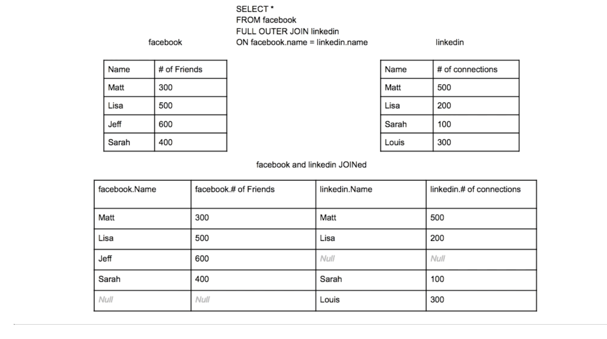

* Inner Join
* If a value is missing from any table it does not get added
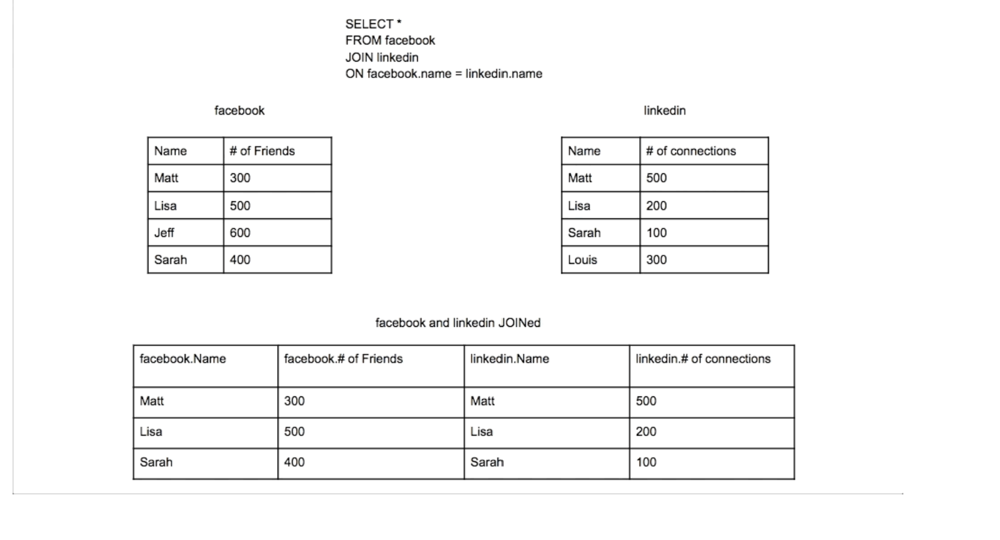


* left join
* left value must be present
* right join right value must be present, but when you have 3+ joins in a table is that possible or is it concatenated joins?
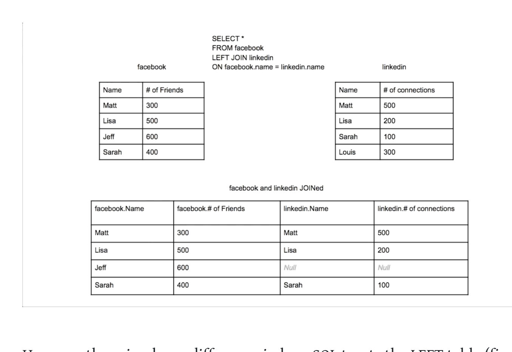

## Include columns in a index
* key lookups are bad for a large number of rows
* its a tradeoff

## Filtered Index
* a where clause, fewer rows for the queries
* use case is soft delete
* donesnt include paramterized
* we like our queries parameterized, best for binary queries

## Nonclustered index summary
* no index for columns,

# Indexed
* also materialized views
* also the base table modifed index modified, it needs to be monitored so its not doing more harm than good

# Designing Columnstore Indexes for Analytic Queries
* values that are store in columns are stored together

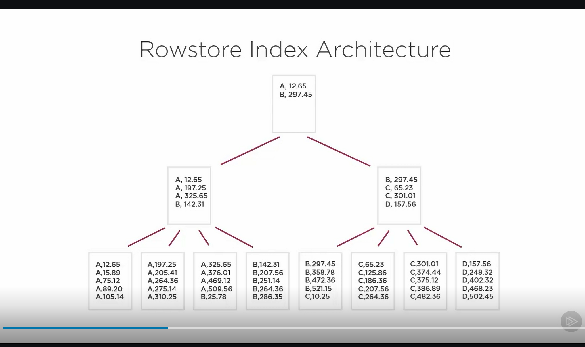


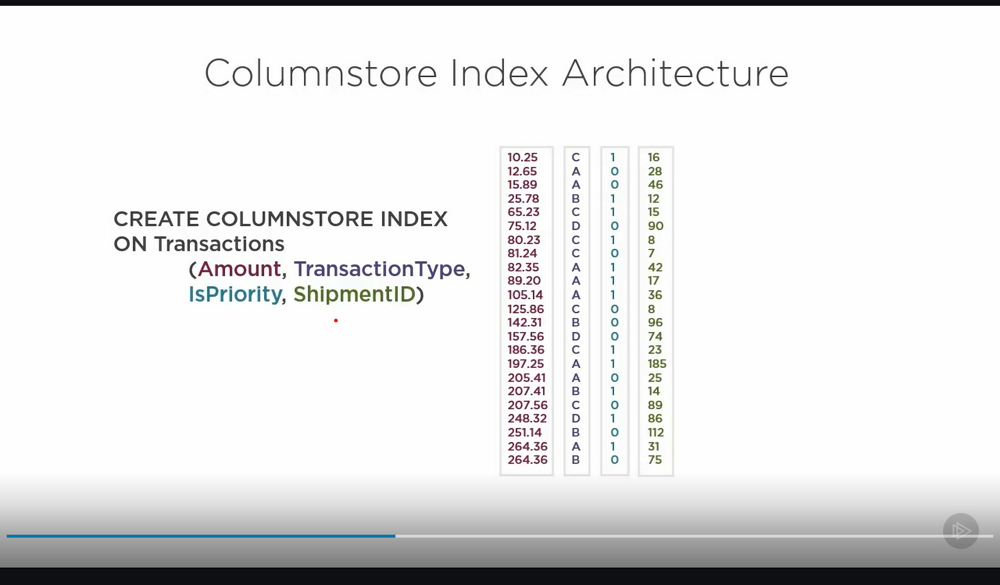
* they are rows stored based on their order, evey though they are stored as colums so for the row where Amouhnt  = 80.23

Amount[7],TransactionType[7] ..

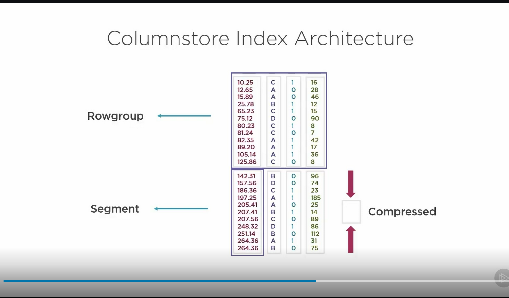
* modificiation are really difficult

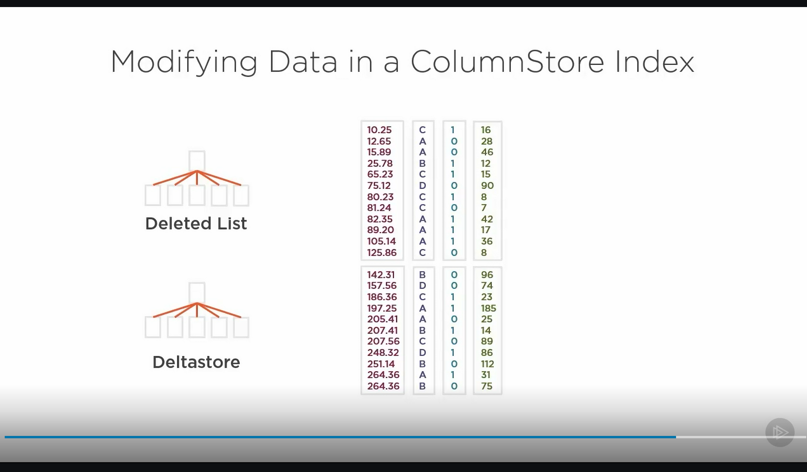

[columnssotre uses less pages](08\demos\Module 7\TestingColumnStore.sql)


* run the query with the columnstore index, and see the differene by default the table  is an heap

* when you have nonclusted columnstore index on some rows there are 2 indexes
* if you see sys.dm_db_partition_stats you see you have  a seperate entity
```SQL
CREATE CLUSTERED COLUMNSTORE INDEX idex_ShipmentDetails ON dbo.ShipmentDetailsColumnStore

DROP INDEX idex_ShipmentDetails ON dbo.ShipmentDetailsColumnStore

CREATE NONCLUSTERED COLUMNSTORE INDEX idx_ShipmentDetails ON dbo.ShipmentDetailsColumnStore (Mass,Volume,ShipmentID)

SELECT * FROM sys.indexes WHERE OBJECT_ID = OBJECT_ID('ShipmentDetailsColumnStore')


SELECT object_id,
       index_id,
       used_page_count,
       reserved_page_count,
       row_count
FROM sys.dm_db_partition_stats WHERE OBJECT_ID = OBJECT_ID('ShipmentDetailsColumnStore')

```

* to see rows in deltastore after update command
```sql
SELECT * FROM sys.column_store_row_groups

```

* rebuild causes the deltastore to compress itself and update the columnstore pages
```sql
ALTER INDEX idx_ShipmentDetails ON dbo.ShipmentDetailsColumnStore REBUILD
SELECT * FROM sys.column_store_row_groups
```
* reogranize does merging
```sql
ALTER INDEX idx_ShipmentDetails ON dbo.ShipmentDetailsColumnStore REORGANIZE
SELECT * FROM sys.column_store_row_groups
```


## Colummn Store Guidelines
* analytics and data warehouse systems
* good for seraching plenty of small rows
* repeating data
* aggregate queries


* bad
  * queries seeking a small # of rows
  * small tables
  * many writes
  * small partitions
  * encrypted data
  * distact,random


## Column Store Query Results
* on an aggreegate query, you get batch mode whcih means operations are performed in parallel, most queries on done in row
  * column order for columns tore doesnte matter

