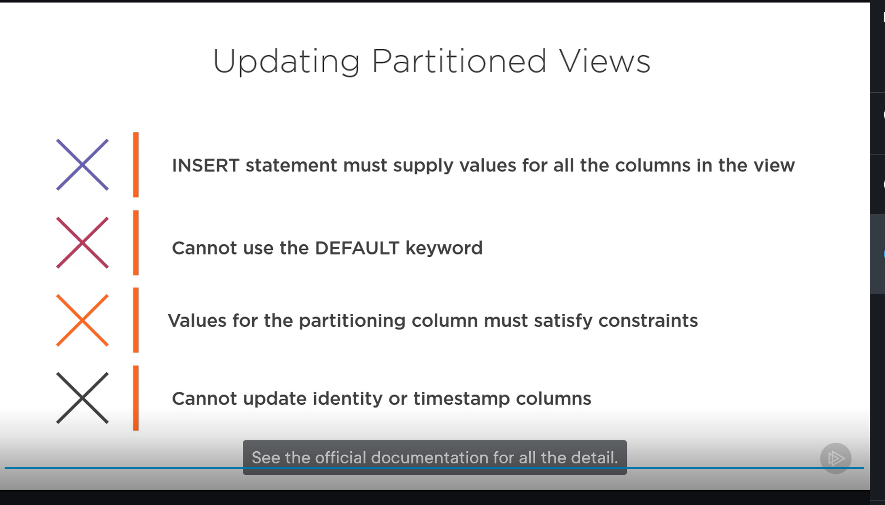

# Takeaways
* try to get your tables in 3NF
* USE NOT NULL,DEFAULT,PRIMARY KEY,UNIQUE,FOREIGN KEY and CHECK constratins to get rid on anamolaies
* IMPLICIT instead of explicit don't rely on server defaults

# Questions
* for partioned views can't I just have like a partioned table I don't want to keep creating tables for every order year
# Install

* you can also use vscode extension azure data studio
[Azure Data Studio](https://learn.microsoft.com/en-us/sql/azure-data-studio/download-azure-data-studio?view=sql-server-ver16)

[Download Docker Image](https://hub.docker.com/_/microsoft-mssql-server)

* run the sql server
```ps1
docker run -e "ACCEPT_EULA=Y" -e "MSSQL_SA_PASSWORD=wX.D}/n(ZNpzVr}" -e "MSSQL_PID=Express" -p 1433:1433 -d mcr.microsoft.com/mssql/server:2022-latest
```

* connect to server
``` ps1
docker exec -it   confident_poincare /opt/mssql-tools/bin/sqlcmd -S localhost -U sa -P "wX.D}/n(ZNpzVr}"
```

export PATH="/opt/mssql-tools/bin:$PATH";
sqlcmd -S localhost -U sa -P "wX.D}/n(ZNpzVr}"  -i '00 Apply.sql'


* connecti to running container
```ps1
docker exec -u 0  -it   confident_poincare /bin/bash
```

* see container names
```ps1
docker ps -a
```

* stop server
```ps1
docker stop  [container name];docker rm [contianer  name]
```


* connect to the db using azure data studio or mssql vscode extension
```ps1
Server=localhost; Database=master; User Id=sa; Password=wX.D}/n(ZNpzVr}
```


## Business Problem Bob's Shoes
* bob has a business that has grown large
* this is for transactSQL


# Designing and Implementing Tables
* __DDL__ - data definition language
* table should have primary key and nullable
* avoid special chaacters, and reserved words, spaces

## Nanimg Convetions
* use camelCase,undersoce seperated or hybrid

## Character Data Types
* nchar- for system that store text in several languages
* SQL will reject data too long or warn truncation may occur

## Data types Integer
tinyint  0 - 255
, smallint 2^15,
int - 8 billion
bigint- 92.6 sextillion


## Using  Decimal Types
* decimal[(p,s)] numeric[(p,s)]
p - precison - total # of digits to be stored
  * ranges from 5-17 bytes
s -scale - digit total number stored to right of decimal point

* were using precison 4, scale 2

## Using Date and Time Types
* dates

* time[(n)]
  * number of seconds to be stored
  * default 7,range 0-7,precise as 100 nanoseconds
  * 5 bytes

* dateime
  * cant go before jan 1,1753 to dec 31 9999-
  * 8 bytes

* smalldatetime
  *jan 1 1900- jun 6 2079

*dateime2(n)
  * date + time types
  * specifc time precison

* datetimeoffset(n)
  * date + time +timezone
  * 10 bytes

* bit types
  * for flags and switches

## Demo 1: Creating the Order Tracking Table
* in azure data studio open and run Designing_and_Implementing_SQL_Server_Tables_and_View\03\CreateDatabase.sql
  * be sure to replace the file name paths of where you actually want the project to be


* to see files
```sql
EXEC sp_helpfile;
```

* schemas are were your tables go
  * extra namespace
  * managing security
* put data in log files on separate drives in a production setting

* files for your db
```sql
ADD FILEGROUP BobsData;
```

* add a data file to the database
```sql
ALTER DATABASE BobsShoes
    ADD FILE (
       NAME = BobsData,
       FILENAME = '/home/mssql/project0/BobsData.mdf'
    )
    TO FILEGROUP BobsData;
```


* add a  log file to the database
```sql
ALTER DATABASE BobsShoes
    ADD LOG FILE (
        NAME = BobsLogs,
        FILENAME = '/home/mssql/project0/BobsLog.ldf'
    );

```

* open and run
Designing_and_Implementing_SQL_Server_Tables_and_View\03\CreateDatabase.sql
__ IDENTITY (1,1)__ - means whenever a new row is created an id in inserted into the table

* computed column
```sql
  TotalPrice AS (Quantity * UnitPrice * (1.0 - Discount)), -- PERSISTED
)
```


* creates the table in the filegroup BobsData
use data compression helpes with IO and CPU needed to handle it
```sql
CREATE TABLE Orders.OrderTracking (
  ...
)
ON BobsData
WITH (DATA_COMPRESSION = PAGE);
```

* Designing_and_Implementing_SQL_Server_Tables_and_View\03\CreatePrimaryKey.sql

* primary key make sure  table is proper relation


## Using Collations
[FILE](03\Collations.sql)
* collations is a fancy name for encoding
  * each row has its own collation (encoding)
* specific bit patterns that represent each char in a dataset
  * specifc at database,column and instance level
* used for i18n?
* can be specificed on columns in CREATE TABLE

# Improve table design through normalization
* reduce redundancy and improve integrity
* in this query we have duplicate data, if arthuer moves then everything has to be updated, why are we storing duplicate data
* DRY principle
```sql
INSERT INTO Orders.OrderTracking(

	)
VALUES
	('20190301', '20190401', 'Arthur Dent', 'Golgafrincham', 'Oxford', '10_D', 'OXFORD01', 50.0, 1, 0, 0),
	('20190301', '20190401', 'Arthur Dent', 'Golgafrincham', 'BabySneakers', '3', 'BABYSHO1', 20.0, 1, 0, 0),
	('20190301', '20190401', 'Arthur Dent', 'Golgafrincham', 'Killer Heels', '7', 'HEELS001', 75.0, 1, 0, 0);
```


## Setting Objectives for Normalization
* structure of info as impt as info itself
* dont want to change design becuasue new data points begin to appear
* so dont use address as column becuase other ppl many not get the memo and don't know what address to put you have insert ananomaly
* you delete a row for an order than has not shipped, delete analomoy

## First Normal Form -1NF
* rules
  * one value per table cell
  * one table per set of related data
    * the customer address is not related to the amnt of shoes in the order
* each row must have 1 primary key (simple) or more (composite)

[1NF rULE](04\demos\1NF_Rule_1.sql)

* its a good practices to write all columns in the table for a query to execute

* bad practice there are 2 values for shoe type 'Oxford, Wing tip',
```sql
('20190301', '20190401', 'Arthur Dent', 'Golgafrincham', 'Oxford, Wing tip', '10_D', 'OXFORD01', 50.0, 1, 0, 0)
```
* good practice
```sql
    ('20190301', '20190401', 'Arthur Dent', 'Golgafrincham', 'Oxford', '10_D', 'OXFORD01', 50.0, 1, 0, 0),
    ('20190301', '20190401', 'Arthur Dent', 'Golgafrincham', 'Wing tip', '10_D', 'OXFORD01', 50.0, 1, 0, 0)
```
* princple of confirmity,
  * column with same meaning should have same name and type
[New Tables]([1NF rULE](04\demos\NewTables.sql)
* Orders.Orders ,
Orders.Stock - to keep track of inventory
Orders.Orders - to anchor all orders
  * has reference to customer table CustID
Orders.OrderItems - items in each order
  * refers to Orders.Orders  with OrderID

* always name your primary key
```sql
    CustID int IDENTITY(1,1) NOT NULL -- PRIMARY KEY,
        CONSTRAINT PK_Customers_CustID PRIMARY KEY,
```
* we use primary key to help with data integrity
* sql server takes your primary key and makes them unique and clustered
  * clustered table data is ordered by clusterId can only be one
  * non clustered does not impose any order to table data

* with tables this satifies 1NF however there is problem, I can insert orders for non-customers


## Understanding Second Normal Form
* builds on 1NF
* single column primary keys are allowed
* so an id  cant be a combination of 2 columns
[2NF](04\demos\2NF Tables.sql)
* Orders.Stock has column StockID
  * this is known as Surrogate Key (from Business Key)

* Orders.OrderItems
  replace StockSKU StockSize with StockID Surrogate
* __foreign key__ used if we try to enter a primary key referenced in another table whose values does not exist
  * cant enter order item, if if the order id doesn't exist

[Foreign Key](04\demos\ForeignKeys.sql)
* but if I need to delete an order, all order items that reference an order need to get deleted

## Understanding Third Normal Form
* data must be in 2nf
* column values must depend upon the key
  * update to one column should not cause update to another,unless other column is a key
  * every non-key must provide a fact about the key, the whole key and nothing but the key

* exnample
* fola marries dipe so her last name changes from tamibinye to iguodala, her last name changes but so doe her salutation from mrs to miss
* when tables have foreign keys, you have to drop in order of 1st reference
* in azure data studio you may have to seperately run statements
* make salutations table with salutations id to get red of the problem
[3NF](04\demos\3NF Tables.sql)
```sql
CREATE TABLE Orders.Salutations (
    SalutationID int IDENTITY(1,1) NOT NULL
        CONSTRAINT PK_Salutations_SalutationID PRIMARY KEY,
    Salutation varchar(5) NOT NULL
)

CREATE TABLE Orders.Customers (
    CustID int IDENTITY(1,1) NOT NULL
        CONSTRAINT PK_Customers_CustID PRIMARY KEY,
    CustName nvarchar(200) NOT NULL,
    CustStreet nvarchar(100) NOT NULL,
    CustCity nvarchar(100) NOT NULL,
    CustStateProv nvarchar(100) NOT NULL,
    CustCountry nvarchar(100) NOT NULL,
    CustPostalCode nvarchar(20) NOT NULL,
    SalutationID int NOT NULL
        CONSTRAINT FK_Customers_SaluationID_Salutations_SalutationID
            REFERENCES Orders.Salutations (SalutationID)
);
```

* chanllege, create city,state,country,zipcode table with its own addressId, then update the customer table to reference via address Id

## Considering Other Normal Forms
* (3.5NF) -
* (4NF)-
* (5NF)
* (6NF), Temporal table

# Ensuring Data Integrity with Constraints
* to NULL or not to NULL
* sql is based on three value logic: true,false unknown
  * Default constraint, when you don't know the value the default can be used instead
[DefaultConstraints](05\demos\DefaultConstraints.sql)
* cant alter constraint you have to drop it and recreate it

## Using Index Types and the UNIQUE Constraint
* customer_id - non clustered (no order)
* customer_name - clustered(order) index
* unique constraint - no duplicate values, allow for 1 NULL
  * can be referend by foreign key
  * same stock item should only appear once per order use the unique key in Order.OrderITEMS
[PrimaryAndUniqueConstraints](05\demos\PrimaryAndUniqueConstraints.sql)
* column default to noncluster index, primary key defaults to cluster unless there is one

## Foreign Keys
[ForeignKeys](05\demos\ForeignKeys.sql)

* if the Orders.Stock  deletes  StockID this table will delete all rows referencing StockID
```sql
    StockID int NOT NULL
        CONSTRAINT FK_OrderItems_StockID_Stock_StockID
            FOREIGN KEY REFERENCES Orders.Stock (StockID)
                ON DELETE CASCADE,
```


[ForeignKeysUpdateCascade](05\demos\ForeignKeysUpdateCascade.sql)
* if the key in the refencing table changes, this get set to null
```sql
CREATE TABLE _2 (
    StatChar CHAR(1) NULL REFERENCES _1(StatChar)
            ON UPDATE SET NULL
    );
```
```sql
ON DELETE | UPDATE CASCADE
ON DELETE | UPDATE NO ACTION
ON DELETE | UPDATE SET NULL
ON DELETE | UPDATE SET DEFAULT
```

## Demo 4 - Using CHECK Constraints
[CheckConstraints](05\demos\CheckConstraints.sql)

* if you highlight you have to go into table def to find out whats wrong
* always name all your expressions and constraints


```sql
    CONSTRAINT CK_Stock_SKU_cannot_equal_Description CHECK (StockSKU <> StockName )

-- try to violate the constraint
INSERT INTO Orders.Stock(StockSKU, StockSize, StockName, StockPrice)
VALUES ('abc', '1', 'ABC', 1);
```

```sql
-- Create a user function to check dates
GO
CREATE OR ALTER FUNCTION Orders.CheckDates
    (@OrderDate date, @RequestedDate date)
    RETURNS BIT
    AS BEGIN
        RETURN (IIF(@RequestedDate > @OrderDate, 1, 0))
    END
GO

-- Define a table constraint to use the function
DROP TABLE IF EXISTS Orders.Orders;
CREATE TABLE Orders.Orders (
    OrderDate date NOT NULL,
    OrderRequestedDate date NOT NULL,
    CONSTRAINT CK_Orders_RequestedDate_must_follow_OrderDate
        CHECK (1 = Orders.CheckDates(OrderDate, OrderRequestedDate))
 );
```

* if you change Function for CHECK  you need to manually tell sql to make that update to the table
avoid fns with long queries
* challenge
  * can the number of items be less than one
  can delivery date precede order,
  verify shoe sizes
  country name
  negative prices

* you can add constrainst at any time


## Designing View to Meet Business Requirements
* everyone can write a different joins hard to maintain

### Reviewing the Bobs Shoes Order System Design
* client doesn't care about certin parts of the table
* views are virtual tables
[Customer List](06\demos\CustomerList.sql)
* best practies
  * alias the tables being created
  * always use join to join tables
  * use two part name for column references, [table alias.column name]

* make a view
* this means for each customer, if the customer.cityStateId matches city.cityStateId this view will have the seleted entries from the city table joined with the selected enteries from the customer table
```sql
CREATE OR ALTER VIEW Orders.CustomerList
AS
  SELECT
    cust.CustName,
    city.CityStateCity,
    city.CityStateStreet,
    city.CityStateProv,
    city.CityStatePostalCode,
    city.CityStateCountry
  FROM Orders.Customers cust
    INNER JOIN Orders.CityState city
      ON cust.CityStateID = city.CityStateID
    INNER JOIN Orders.Salutations sal
      ON cust.SalutationID = sal.SalutationID;
GO

SELECT
  cl.CustName,
  cl.CityStateStreet,
  cl.CityStateCity,
  cl.CityStateProv,
  cl.CityStatePostalCode,
  cl.CityStateCountry

FROM Orders.CustomerList cl;
GO

```

* when tables update views don't application using this code will break
[ShemaBinding.sql](06\demos\ShemaBinding.sql)

* WITH SCHEMABINDING
  * base tables can't be changed
  * SELECT statement must use 2 part names
  * all referenced objects must be in the same database
  * must reference a schema

## Updateable Views
* any modifications means if view uses 2 or more tables only one can be used
* can't be modified by GROUP BY,HAVING,DISTINCT,PIVOT or UNPIVOT clauses
* TOP,OFFSET may indicate data may be hidden, these are not allowed

[UpdateableCustomerList](06\demos\UpdateableCustomerList.sql)
[UpdateableOrderSummary](06\demos\UpdateableOrderSummary.sql)

# Implementing Indexed view
* views can  be indexed which can speed up yr queries
* indexed view is persisted
* view does not have to be referenced in the query for the optimizer to consider that view for a substitution
* must have
```sql
WITH SCHEMABINDING
```
* determisitic means, all indexed views must return the exact same result
  * getDate is non deterministic
  * getOS is determisitic  since the OS may never change
  * can use isDetermistiic property

[Determinism](07\demos\Determinism.sql)
* this is determisitic but not precise
```sql
oi.Discount * cast(.90 as [float]) AS Two
```

## YMIVR - Yet More Indexed View Requirements
* cant use these for idnexed views

* if you use date literals explicitly convert them to the time you want

## Demo 2 - Indexing the Customer List View

[CustomerListIndexes](07\demos\CustomerListIndexes.sql)

* we need something that is indexable such as cluster Id to help us win indexable view
```sql
CREATE OR ALTER VIEW Orders.CustomerList
WITH SCHEMABINDING
AS
  SELECT
    cust.CustID               AS CustomerID,
    ...
  FROM [my join statement]

-- Create a Unique, clustered index on the view
DROP INDEX IF EXISTS UQ_CustomerList_CustomerID ON Orders.CustomerList;
CREATE UNIQUE CLUSTERED INDEX UQ_CustomerList_CustomerID
    ON Orders.CustomerList(CustomerID);
GO
```

* if we unccoment EXPAND views the views get querired directly
```sql
-- Query the view
SELECT CustomerID, Name, Salutation, City
    FROM Orders.CustomerList
    WHERE CustomerID = 1
    -- OPTION (EXPAND VIEWS);
GO
```

[OrderSummaryIndexes](07\demos\OrderSummaryndexes.sql)
* if you know a view will be queried many more times than the base table is updaed better to use indexing

# Implementing Partitioned Views
* think long terms
  * what happens when you have old orders you dont need
* cant be indedex


## Requirements
* partioniong column must be primary key
* cannot be computed identity,default or timestamp
* only one partitoning constraint
* no restrictions on partitioning updateabliltiy


[PartitionedViews](08\demos\PartitionedViews.sql)
* columns in the union tables must have the same name

* the view is partioned based on order year, so now if there is lookup from orders on a certain year, results are quicker
```sql
-- Create partitioned view
CREATE VIEW Orders.PartitionedOrders
WITH SCHEMABINDING
AS
    SELECT OrderID, OrderYear, ...
    FROM Orders.Orders
    UNION ALL
    SELECT OrderID, OrderYear, ...
    FROM Orders.Orders2018
GO
```



