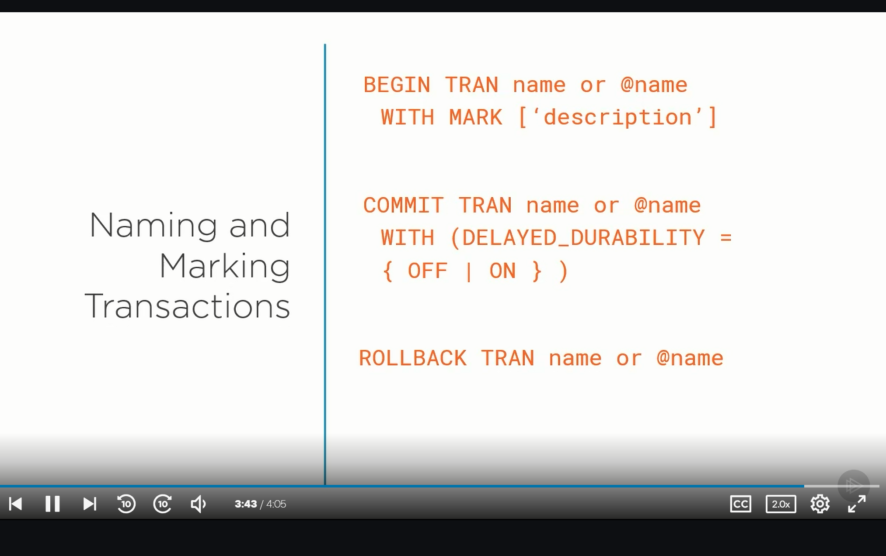

* how are business gr8
* a simple query that can bring a system to its knees

## Intdocuing SQL Server Concurrency Control
* concurrency is like a big highway
* in computer
  * cooperative processes yield control to the CPU
* SQL works hard to squeeze as much as data as possible

## Understanding ACID
ACID pricinple
A- all or none items are performed
C- consitiatley
I- TRANSACTION are isolated
D- results are stored permanetley in the system

# Understanding Transactions

* uses transaction log if the database phyiscal hardware fails
* uses locking

* to know your sql version
```sql
SELECT @@VERSION AS [Version];
GO
```
[More Config fns](https://docs.microsoft.com/en-us/sql/t-sql/functions/configuration-functions-transact-sql)


[FirstTransaction](03\demos\FirstTransaction.sql)
* what happens if something happens while you are reading the table

[Explicited](03\demos\ExplicitTransaction.sql)

[Nested]
(03\demos\NestedTransactions.sql)

[Implicit]
(03\demos\ImplicitTransactions.sql)
* bad practice, check settings


* each tranasction is in autocommit mode




[Savepoints](03\demos\Savepoints.sql)
* when you rollback to a save point you dont start again at the save point you continue

# Managing Basic Isolation Levels
* isolation levels directly affect concurrency


## Read Uncommitted
with the files dirty read is when you read once and a transaction will get rolled back, the transaction rolls back you read again and the values change

* non repetable reads 2 transaction commit but with the data I see 2 different rows

* phantom read happens with rollback inserts, here today gone tmr

* table hints are discouraged

## Read Commited
* default transaction setting for sql

*see the setting
```sql
SELECT
    CASE transaction_isolation_level
        WHEN 0 THEN 'Unspecified'
        WHEN 1 THEN 'ReadUncommitted'
        WHEN 2 THEN 'ReadCommitted'
        WHEN 3 THEN 'Repeatable'
        WHEN 4 THEN 'Serializable'
        WHEN 5 THEN 'Snapshot'
    END AS TRANSACTION_ISOLATION_LEVEL
FROM sys.dm_exec_sessions
where session_id = @@SPID;
```

* READ UNCOMMITED doesn't wait or timeout
* Repeatable read waits until the the lock is released

[Repeatedable Read](04\demos\RepeatableRead.sql)

with

[Non Repeatable Read](04\demos\NonRepeatableRead.sql)
* needs a lot of row to cause a phantom reads
* Seriablize reads prevent phantom reads
* there is Optmisitic and Pessimitic Concurency

## Implementing Snapshot Isolation Levels
*


[EnableSnaphotIsloation](05\demos\EnableSnapshotIsolation.sql)
* with snapshot isloation, read queries can execute and return the same data w/o waiting for the update to rollback its changes
* like running read uncommited w/o risks of anomalies

[ SnapshotIsolation_Session_1]05\demos\SnapshotIsolation_Session_1.sql)
[ SnapshotIsolation_Session_2](05\demos\SnapshotIsolation_Session_2.sql)

* but its not working properly


# Locking  in the  SQL Server Database Engine (06)
* deadlock - two or more tasks deadlock each other


* run Arthur and Trillain
thenrun dm_tran_locks.sql
* there are 4 locks which are shared, S stands for in request_mode
* I means intending for a share lock
* When Triilan wants to make an update there is an exclusive X lock

* use SP_WHOisActive free stored procedure to better understand what is going on

* something known as locking granality and hierachy
* sql sever gets a levels of locks from db to table to page to row  to protect resource

* this is a hierachy


* update used prevent deadlocks
* intent locks are acquired before full locks
* key-range - prevents phantom reads
null -lock make sure key doe snot exist for update


* concurrency and granulaity has inverse relationship

lock eslcation you can only specify behaviour, let sql server manage lock dynamic

* if you lock at LockEscalation as you increase the amount of rows and run lockEscalationLocks, you see that the transactions have to commit because of lock escaltion

* as you go highter the database get lcoked


* there are updated,shared,exclusive and full lock


try to run Trillian Arthur and dm_tran_locks from v7 to se ethe locks, but its not showing

* in ArthurUpdate and TrillanUpdate run the first UPDATE both script try to do update in opposite directores
* update and exclusinve are not compatablite
* sql server has a deadlock detector that runs every 5 mins, look at the execulation plan for the sql to see which one is the deadlock victim

## Deadlock Analysis tools

* need Microsft SSMS to see the deadlock in Extended Events
however GetDedadlockGraphs can generate xml for the chart you see in ssms
  * however it looks like the deadlock events are not persisted
use server_event_sessions.sql to get server health,

* deadlocks disappear quickly but use this if you can figure it out
[DeadlockExtendedEventSession](07\demos\DeadlockExtendedEventSession.sql)

## Application Considerations
* fail the processs , retry until deadlock passes
* avoid deadlocks, keep transactions short, deadlock priority

ArthurUpdateLow TrillianUpdateHigh so aruthher is the victim
