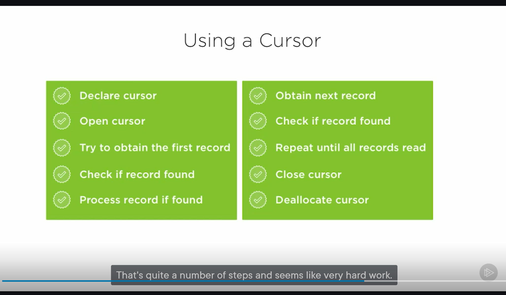
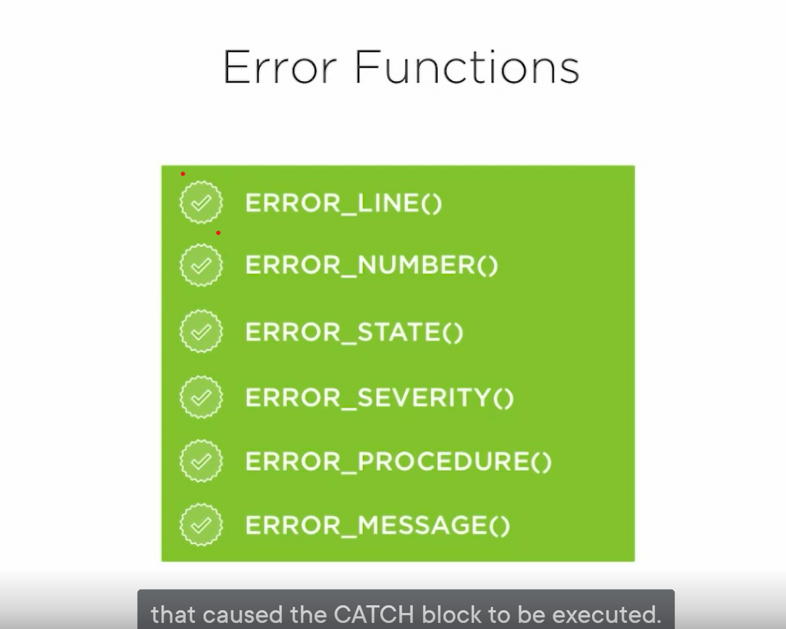

# Takwaways
* procuedures should always return consistent output

# Creating Your Stored Procedures

* block of code which perform action on the database
* stay in database write code once execute many times
* stored procedure happens in the database good for security and less network calls, client onnly talks to stored procedure
* the sql server recongize stored procedure and will learn more efficient ways of executing them

* don't use cursor,
* do not use a lot of result sets


* steps to setup the contacts dv
* copy the files over to the docker container
```ps1
docker cp .\Database\ confident_poincare:/home/mssql/project1
```

```shell
# as root
cd /home/mssql/project1;
chmod 777 Database;chmod 777 Database/*;
su mssql;
export PATH="/opt/mssql-tools/bin:$PATH";
cd ~/project1/Database/contactsdb;
sqlcmd -S localhost -U sa -P "wX.D}/n(ZNpzVr}"  -i '00 Apply.sql'
```


## Stored Procedure T-SQL statement
* crete procedure
```sql

CREATE PROCEDURE dbo.SelectContacts
AS
BEGIN;

...

END;
```

* execute stored procedure
```sql
-- excute the stored procedure
USE Contacts;

EXEC dbo.SelectContacts

```
* disk is where plenty of tables are stored

* older way just to check if the procedure exists
```sql
IF EXISTS(SELECT 1 FROM sys.procedures WHERE [name] = 'SelectContacts')
```

# Creating Stored Procedures using Paramters;


## The Business Requirement

* create a paramerterized stored procedure
  * this is how your select variables
```sql
CREATE PROCEDURE dbo.InsertContact
(
 @FirstName				VARCHAR(40),
 @LastName				VARCHAR(40),
 @DateOfBirth			DATE = NULL,
 @AllowContactByPhone	BIT,
 @ContactId				INT OUTPUT
)
AS
BEGIN;
END;
```

* to declare vars in t-sql

```sql
DECLARE @FirstName  VARCHAR(40),
        @LastName  VARCHAR(40),
AS
BEGIN;

SELECT @FirstName = "Stan"
       @LastName = "Laurel"
```

* [Parameterized Stored Procedures](03\demos\Module 3)
## Optional Parameter

```sql
DECLARE @FirstName  VARCHAR(40),
        @LastName  VARCHAR(40) = NULL,
AS
BEGIN;

```

## Retrieving Record Identifiers
@@IDENTIY is the last id added in the entire databae
better than where clause because it is deterministic the value wont change
still bad because it may activate a trigger for another table
use SCOPE_IDENTIY last value for table, this makes an insert on 2 table
```sql
SELECT @ContactID = SCOPE_IDENTIY
```


## Using SET Options
SET NOCOUNT - disables messages that STORED PROCEDURES use

## Calling a Procedure from another  procedure
* insertstore becomes selectstore sql

## Control Flow
* procuedures should always return consistent output

# Table-valued Parameters and Refactoring

## Inheriting a Stored Procedure

[Junior dev store procedure](04/demos/Module%204/01%20Insert%20Contact%20Notes%20Stored%20Procedure%20CSV%20Version.sql)
  * there is a CURSOR bad practice



## Alternatives to Cursors
[Using set statement to insert as one batch]
* bad practices to insert data into data base based on SPLIT_STRING,which only accepts one char at a time

## User defined datatypes
[dRIVING TYPE](04/demos/Module%204/04%20Create%20Type%20Driving%20License.sql)
* only allowed to drop type if no other objects are using it

[contact note table type](04/demos/Module%204/05%20Create%20Type%20ContactNote.sql)

[create stored procedure with tvp](04/demos/Module%204/07%20Insert%20Contact%20Notes%20Stored%20Procedure%20Type%20With%20Table%20Update%20Script.sql)

* tvp only allows table from reference it does not want them directly to do this use a temp var
```sql

DECLARE @TempNotes	ContactNote;

INSERT INTO @TempNotes (Note)
VALUES
...
EXEC dbo.InsertContactNotes
	@ContactId = 23,
	@Notes = @TempNotes;

```
[run tvp stored procedured](04/demos/Module%204/08%20Insert%20Contact%20Notes%20Stored%20Procedure%20Test%20Script.sql)

# Debugging and TroubleShooting Stored Procedures

## The Print Statement
[good address](05/demos/Module%205/01%20InsertContactAddress%20Stored%20Procedure.sql)
* turn the procuedrue into sql
* print can only print strings
* they overide SET NOCOUNT
```sql
PRINT @VAR
```

## SQL Server Debugging Tools
* goto
[TRY CATCH SQL](05/demos/Module%205/05%20InsertContactRole%20Stored%20Procedure%20Final%20Version.sql)

* transaction block accesss to the table, should be held for as  little as possible


* @@TRANCOUNT returns all the failed transaction
* ROLLBACK TRANSACTION; will leave the database in a good state
