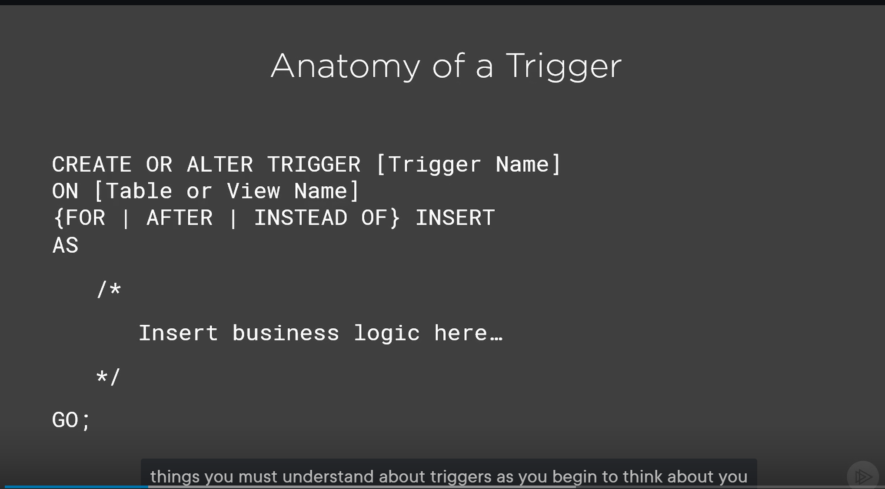
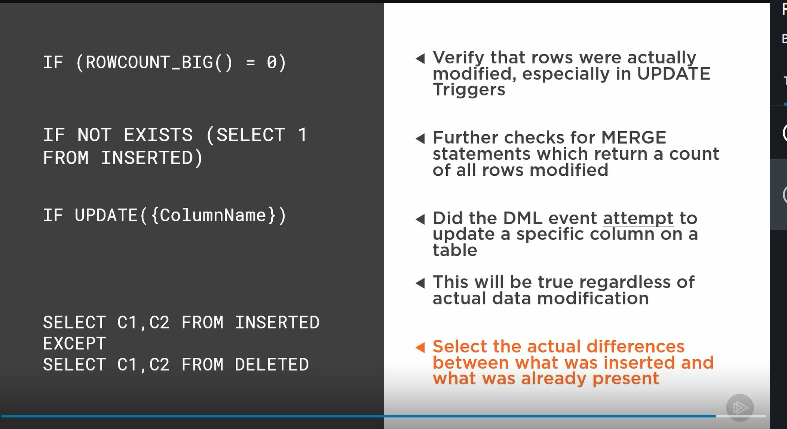

# Validating and Modifying Data with DML Triggers
* good for sql server 2005- 2019

## DML Trigger
* __dml__ data manipulation language
dml tables watch for dm events, (someone attempted too)
* triggers can be used on views
* insert trigger gets the rows affected

## INSTEAD OF AFTER
* default AFTER
* AFTER trigger all constraints passed and data is good
* INSTEAD of, its job of trrigger to complete the action
* triggers can trigger other trigger
  * INSTEAD of runs quickly, really good for legacy systems

## Anatomy of a trigger

* sql trigger always get a batch
* they do not return data
* only one instead of trigger, but many after trigger
* 32 levels deep, and recurisve triggers
* all execute in one transaction, if it fails it rolls back

##
inserted, - trigger gets one new table
update- trigger gets both old and new table
delete - trigger gets old table

* check the row count then check the additional tables

* they say  never use triggers
* good cases
  * insert or modify another
  * use foreign keyss of triggers

