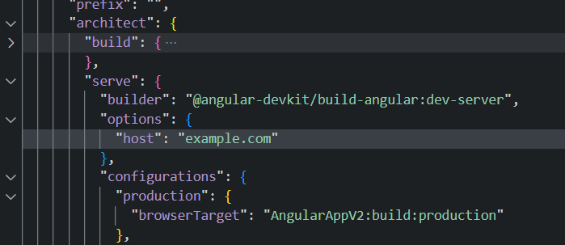

# Resources

* [MKcert tool](https://github.com/FiloSottile/mkcert#installation)
* [Runing flask on https](https://blog.miguelgrinberg.com/post/running-your-flask-application-over-https)


https://github.com/FiloSottile/mkcert#installation

## Steps
* first update etc/hosts
  * add this entry
__FILE__ C:\Windows\System32\drivers\etc\hosts  | \etc\hosts
```sh
127.0.0.1        example.com
```

* [install mkcert](https://github.com/FiloSottile/mkcert#installation)
* run in terminal

```ps1
mkcert -install # accept the prompt to have the cert installed in your system store
mkcert example.com "*.example.com" example.test localhost 127.0.0.1 ::1

```

* mv the 2 files over to flask root
rename example.com+5.pem to cert.pem
rename example.com+5-key.pem to key.pem

in app.py
```py
app.run(debug=True,ssl_context=('cert.pem','key.pem'))
```
* then run the app

for the frontend in this case the angular app when dealing with cookies, no software wants to work with you unless you are in https


so in angular you can add to angular.json but to be safe only update

projects.angularAPP.architect.serve.options.host = "example.com"


* then in the terminal run this command
```ps1
ng serve --ssl --ssl-key <path-to-key-pem> --ssl-cert <path-to-cert-pem>
```
